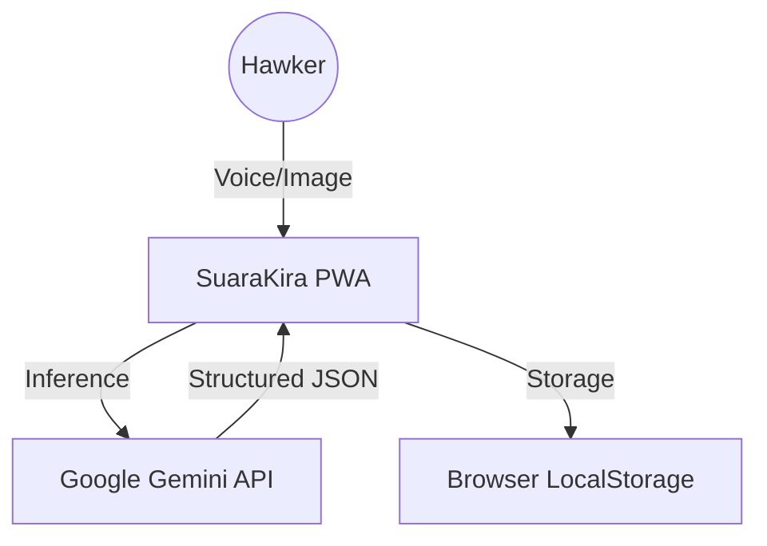

# System Architecture

## Context Diagram

## Core Components
1.  **Input Layer:** `VoiceRecorder.tsx` handles WebAudio API and MediaStream.
2.  **Processing Layer:** `geminiService.ts` handles prompt engineering and JSON sanitization.
3.  **Data Layer:** `db.ts` allows CRUD operations on a persistent local JSON store.
4.  **Presentation Layer:** React + Tailwind for a responsive mobile experience.

## Security Constraints
*   API Keys must be injected via environment variables.
*   No PII is stored remotely (Local-first architecture).

---
*Architect: w3jdev*